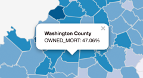

#Lab 01: Making a Choropleth Map with Leaflet

##Part I: Making the map

Examine the contents of the *lab-01/lab-01-data/* directory. This directory includes a starter template *index.html* page, a *ky_counties_housing.json* data file, and a metadata file *ky_counties_housing.txt*.

Use these files to follow the instructions outlined in Lesson 01. 

Additionally, modify the *index.html* to fulfill the requirements listed below. 

The goal of this lab is to create a dynamically generated choropleth map in Leaflet with an accompanying legend. To achieve this, follow the instructions in the Lesson 01, modifying the *lab-01/ab-01-data/index.html* file as you go. Beyond the map described in Module 01, your map should also achieve the following:

1. Represent a normalized data attribute other than the "OWNED_MORT" used in the Lesson 01 example (refer to the metadata file *ky_counties_housing.txt* for a description of data property names).
2. Include a popup triggered when a user clicks on a county. The popup should display the name of the county, the attribute being mapped, and the value of that attribute for that county (converted to and displayed as a nice percentage value). For example:

**Challenge:** Take advantange of some of the new functionality of Leaflet. Rather than using the Popup, use a [Leaflet Tooltip](http://leafletjs.com/reference-1.0.0.html#tooltip).

Save your changes to your *index.html* file and **commit changes to your local GitHub repository** as you work. 

##Part II: Developing a "critical map literacy"

Replace the *lorem ipsum* text at the bottom of the index.html* page with short answers (2 - 3 sentences each) to the following questions:

1. What is the purpose of the map?
2. How does cartographic symbology influence or distort the representation of the data?
3. Does the map have a point of view or support and argument?
